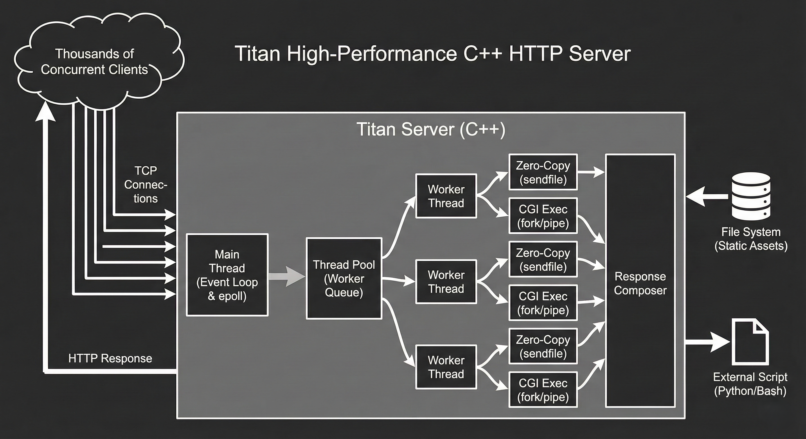
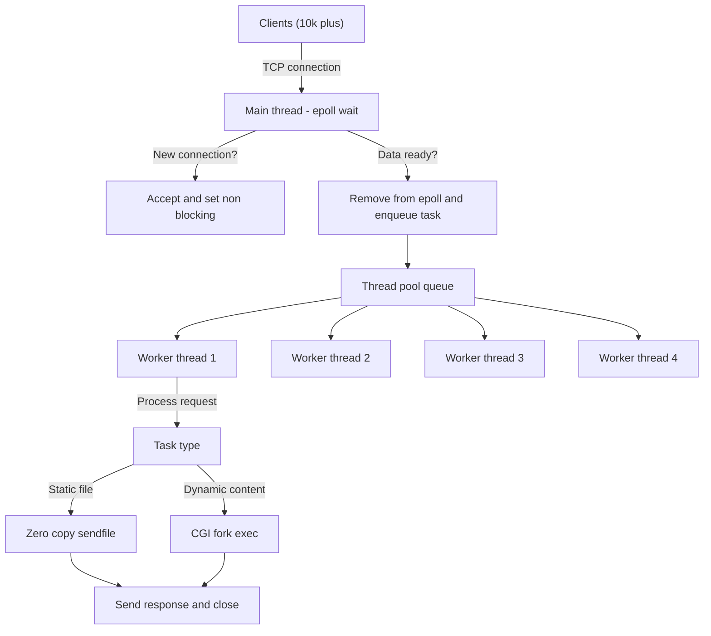

# Titan: High-Performance Linux C++ HTTP Server



**Titan** is a non-blocking, event-driven web server built entirely from scratch using raw Linux system calls. It is designed to demonstrate deep understanding of operating systems, network programming, and high-concurrency architecture.

Unlike typical university projects that use blocking I/O or high-level libraries like Boost.Asio, Titan talks directly to the Kernel using `epoll` and a custom Thread Pool, achieving **O(1) I/O scalability** and easily handling the [C10k Problem](https://en.wikipedia.org/wiki/C10k_problem) (10,000+ simultaneous connections) on standard hardware.

---

## 🚀 Key Features & Architecture

### Core Engine

- **Event-Driven I/O (`epoll`):** Uses Linux's edge-triggered `epoll` mechanism for O(1) event notification, eliminating the CPU overhead of iterating through thousands of idle connections (unlike `poll` or `select`).
- **Custom Thread Pool:** Implements the Producer-Consumer pattern with Mutexes and Condition Variables to offload blocking tasks (CGI, Disk I/O) from the main event loop, ensuring the server never hangs.
- **Zero-Copy Transfer (`sendfile`):** Bypasses user-space memory entirely when serving static files, streaming data directly from the disk cache to the network socket for maximum throughput.

### Protocol & Functionality

- **CGI (Common Gateway Interface):** Executes external scripts (e.g., Python) dynamically using low-level process management: `fork()`, `execve()`, `pipe()`, and `dup2()`.
- **HTTP/1.1 Compliance:** A hand-written parser supporting GET, POST, and DELETE methods.
- **State Management:** Manual parsing and setting of HTTP Cookies for user session tracking.
- **MIME Type Support:** Correctly serves HTML, CSS, JS, and Images.

### Real-Time Monitoring

- **JSON REST API:** Includes an internal `/stats` endpoint providing real-time metrics on thread usage and active connection counts.
- **Live Dashboard:** A vanilla JavaScript frontend that visualizes server performance live.

---

## 🛠️ Architecture Overview

The server uses a Hybrid Event-Driven architecture. The Main Thread handles I/O events non-blockingly, while heavy lifting is delegated to Worker Threads.



## 📦 Installation & Usage
This project requires a Linux environment (or WSL2 on Windows) due to its dependency on the Linux Kernel API (epoll, sendfile).

1. Build the Project
   Ensure you have g++ installed. The -pthread flag is required for concurrency.Bash# Compile the server

```bash
g++ server.cpp -o server -pthread
```

2. Run the ServerNeed to handle thousands of connections? Raise the process file descriptor limit first.

```bash
# Allow many open files
ulimit -n 65535
```
# Start the server

```bash
./server
```

## 🧪 Performance Testing (The C10k Proof)

<p>To verify the architecture's robustness, a Python stress-test script (stress_test.py) is included. It opens thousands of simultaneous TCP connections and holds them open, simulating heavy load. While the test is running, the server's Live Dashboard will show active connections spiking to 5,000+, yet the server remains fully responsive to new requests due to the epoll + Thread Pool design.</p>
