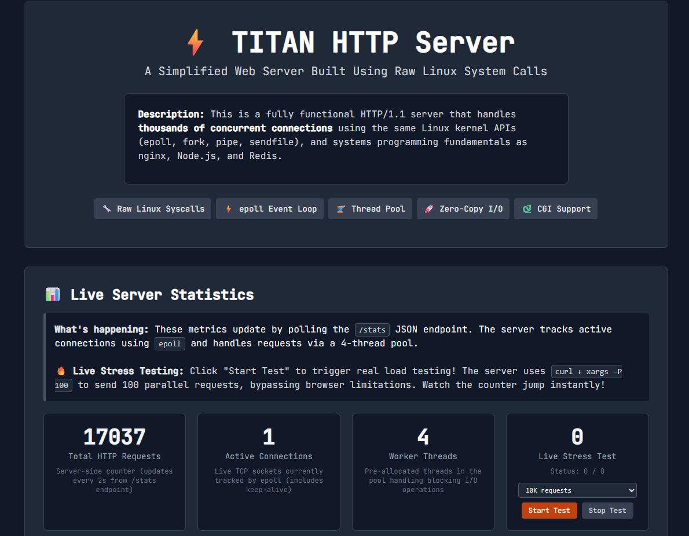
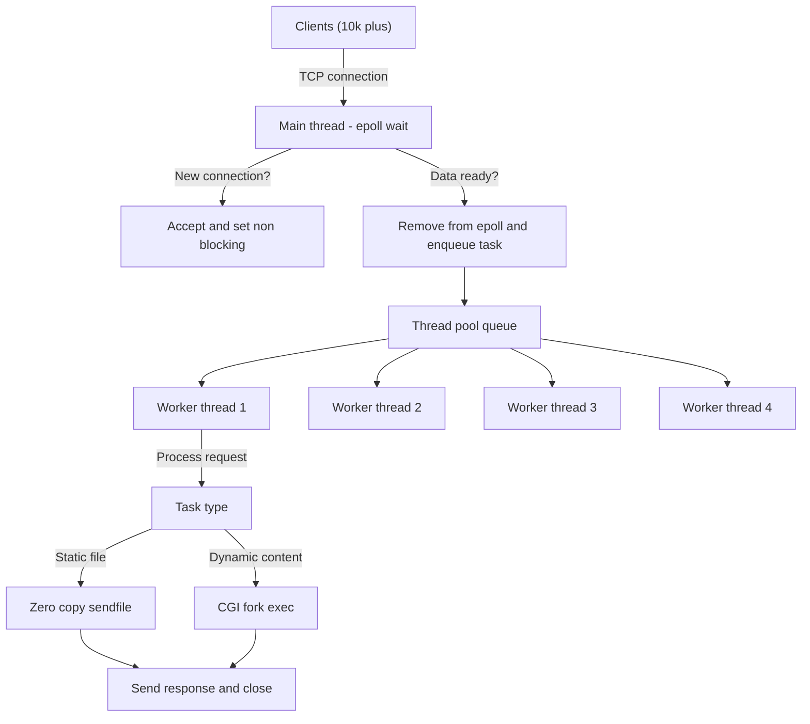

# Titan: C++ HTTP Server (Linux)



A small, from-scratch HTTP/1.1 server built in C++ with Linux system calls. The goal is to learn the low-level pieces behind common servers like nginx: sockets, epoll, threads, and basic HTTP parsing. It is not production-ready, but it is a clear and honest implementation you can read end-to-end.

## What this project covers

- Event-driven I/O with edge-triggered `epoll`
- A simple thread pool for blocking work (CGI, disk I/O)
- Zero-copy static file responses with `sendfile`
- Minimal HTTP/1.1 request parsing (GET, POST, DELETE)
- CGI execution with `fork`, `execve`, `pipe`, and `dup2`
- A live dashboard that polls `/stats`

## How it works (high level)

- The main thread accepts connections and watches them with `epoll`.
- When a socket is ready, the request is parsed and routed.
- Blocking work is dispatched to a worker thread.
- Static files are served directly using `sendfile`.

## Run locally

Linux (or WSL2) is required because of `epoll` and `sendfile`.

```bash
# Build
ulimit -n 65535

g++ server.cpp -o server -pthread -std=c++17

# Run
./server
```

Open the UI:
- http://localhost:8080/

## Useful endpoints

- `/` - UI page
- `/stats` - JSON stats for the dashboard
- `/upload` - POST endpoint for file upload demo
- `/time` - CGI demo (calls `time_server.py`)
- `DELETE /uploaded_data.txt` - delete demo file

## Stress testing

The UI has a "Live Stress Test" button. It calls:

```
/trigger-stress?count=500
```

The server uses `curl + xargs -P 100` to generate parallel requests from the server host itself. This avoids browser connection limits, so the dashboard counter jumps quickly.

Notes:
- The stress test is meant for **local use only**.
- Railway and similar platforms have rate limits. The UI caps stress-test options when deployed on Railway.

## Limitations (by design)

- No TLS/HTTPS
- No HTTP/2 or HTTP/3
- No virtual hosts
- No compression
- No access logs or rotation

## Deployment

And this http server is deployed in [Railway](https://http-server-production-8f4f.up.railway.app/).

## Architecture diagram



---

If you want to dig into the internals, start with [server.cpp](server.cpp) and [HttpParser.h](HttpParser.h).